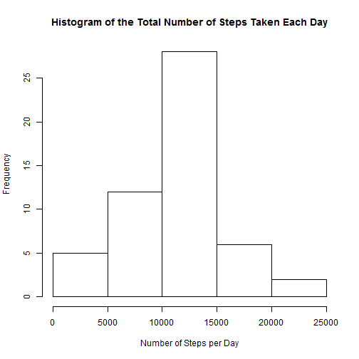
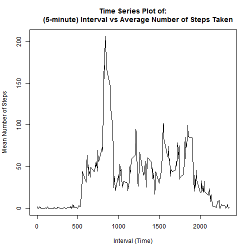
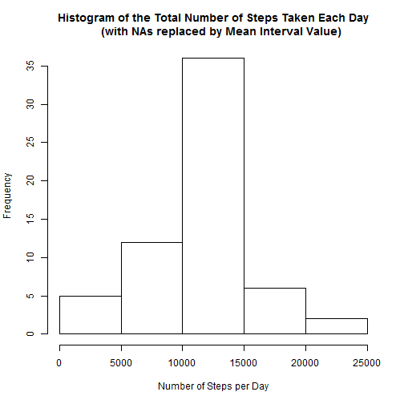
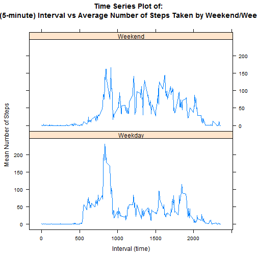

# Reproducible Research: Peer Assessment 1

The following document is a submission for the Reproducible Research course on [Coursera](https://www.coursera.org/) and uses data supplied with the original [GitHub upload](https://github.com/rdpeng/RepData_PeerAssessment1) from R.D.Peng. The instructions, including a link to the original dataset and variable formats can be seen in the "README.md" supplied with that upload.

## Loading and preprocessing the data
The first step is to load the data into R, from the *"Activity.zip"* file. This is done with the following R code:

```r
unzip(zipfile = "Activity.zip")
activitydata <- read.csv(file = "activity.csv")
```

This imports 17,568 observations of the 3 variables: *steps*, *date*, *interval*, with types *integer*, *factor* and *integer* respectively. A summary of the data can be shown here:

```r
summary(activitydata)
```

```
##      steps               date          interval   
##  Min.   :  0.0   2012-10-01:  288   Min.   :   0  
##  1st Qu.:  0.0   2012-10-02:  288   1st Qu.: 589  
##  Median :  0.0   2012-10-03:  288   Median :1178  
##  Mean   : 37.4   2012-10-04:  288   Mean   :1178  
##  3rd Qu.: 12.0   2012-10-05:  288   3rd Qu.:1766  
##  Max.   :806.0   2012-10-06:  288   Max.   :2355  
##  NA's   :2304    (Other)   :15840
```

With the first few entries:

```r
head(activitydata)
```

```
##   steps       date interval
## 1    NA 2012-10-01        0
## 2    NA 2012-10-01        5
## 3    NA 2012-10-01       10
## 4    NA 2012-10-01       15
## 5    NA 2012-10-01       20
## 6    NA 2012-10-01       25
```


## What is mean total number of steps taken per day?
The question states:

    "For this part of the assignment, you can ignore the missing values in the dataset.
        1. Make a histogram of the total number of steps taken each day
        2. Calculate and report the mean and median total number of steps taken per day"

To produce the histogram first we have to summate all the steps taken across each day:

```r
summed_days <- aggregate(steps ~ date, activitydata, FUN = sum, na.action = na.omit)
```

This forms data of the following style, shown from the first 6 rows:

```r
head(summed_days)
```

```
##         date steps
## 1 2012-10-02   126
## 2 2012-10-03 11352
## 3 2012-10-04 12116
## 4 2012-10-05 13294
## 5 2012-10-06 15420
## 6 2012-10-07 11015
```

The histogram of total number of steps per day:

```r
hist(summed_days$steps, xlab = "Number of Steps per Day", main = "Histogram of the Total Number of Steps Taken Each Day")
```

 


The mean total number of steps per day:

```r
mean(summed_days$steps)
```

```
## [1] 10766
```


The median total number of steps per day:

```r
median(summed_days$steps)
```

```
## [1] 10765
```


## What is the average daily activity pattern?

The question states:

    "1. Make a time series plot (i.e. type = "l") of the 5-minute interval (x-axis)
        and the average number of steps taken, averaged across all days (y-axis)
     2. Which 5-minute interval, on average across all the days in the dataset,
        contains the maximum number of steps?"
    
To answer part 1 we need to summate the data across the interval column:

```r
mean_interval <- aggregate(steps ~ interval, activitydata, FUN = mean)
```

The first 6 rows again show the format, with one row for each of the 288 *interval*s and a mean value for the number of *steps* across each of these:

```r
head(mean_interval)
```

```
##   interval   steps
## 1        0 1.71698
## 2        5 0.33962
## 3       10 0.13208
## 4       15 0.15094
## 5       20 0.07547
## 6       25 2.09434
```

A plot can then be created, as requested:

```r
plot(x = mean_interval$interval, y = mean_interval$steps, type = "l", xlab = "Interval (Time)", 
    ylab = "Mean Number of Steps", main = "Time Series Plot of:\n     (5-minute) Interval vs Average Number of Steps Taken")
```

 


## Inputing missing values
The first part of the next question states:

    "1. Calculate and report the total number of missing values in the dataset
        (i.e. the total number of rows with NAs)
     2. Devise a strategy for filling in all of the missing values in the dataset. The
        strategy does not need to be sophisticated. For example, you could use
        the mean/median for that day, or the mean for that 5-minute interval, etc."
        
Assuming the question means the number of rows in the original data set, as we saw earlier, this can be found using:

```r
summary(activitydata)
```

```
##      steps               date          interval   
##  Min.   :  0.0   2012-10-01:  288   Min.   :   0  
##  1st Qu.:  0.0   2012-10-02:  288   1st Qu.: 589  
##  Median :  0.0   2012-10-03:  288   Median :1178  
##  Mean   : 37.4   2012-10-04:  288   Mean   :1178  
##  3rd Qu.: 12.0   2012-10-05:  288   3rd Qu.:1766  
##  Max.   :806.0   2012-10-06:  288   Max.   :2355  
##  NA's   :2304    (Other)   :15840
```

Looking in the lower left of the summary table, the number of NA's (i.e. rows with missing steps values) can be seen as **2304**.

The strategy which will be used here is the suggestion to replace the missing values with "the mean for that 5-minute interval", as the data seems to be quite highly time dependent (as we saw on the last plot).

The next parts of the question then ask:

    "3. Create a new dataset that is equal to the original dataset but with the
        missing data filled in.
     4. Make a histogram of the total number of steps taken each day and Calculate
        and report the mean and median total number of steps taken per day. Do
        these values differ from the estimates from the first part of the assignment?
        What is the impact of inputing missing data on the estimates of the total
        daily number of steps?"
        
To create the new dataset we will first copy the old and then use the vector nature and common label from the two sets to replace the NA with the averaged value in the *mean_interval* set created previously. [N.B. this only works due to the 1:1 parity on *interval* row in the data set]


```r
new_activitydata <- activitydata
new_activitydata[is.na(activitydata)] <- mean_interval$step
```


We can see that this has replaced the NAs we saw from the (head) *activitydata* with the *step* values from the (head) *mean_interval*:

```r
head(new_activitydata)
```

```
##     steps       date interval
## 1 1.71698 2012-10-01        0
## 2 0.33962 2012-10-01        5
## 3 0.13208 2012-10-01       10
## 4 0.15094 2012-10-01       15
## 5 0.07547 2012-10-01       20
## 6 2.09434 2012-10-01       25
```


The requested histogram, as per the first question then becomes:

```r
new_summed_days <- aggregate(steps ~ date, new_activitydata, FUN = sum, na.action = na.omit)
hist(new_summed_days$steps, xlab = "Number of Steps per Day", main = "Histogram of the Total Number of Steps Taken Each Day\n     (with NAs replaced by Mean Interval Value)")
```

 


With the new mean and medians as:

```r
mean(new_summed_days$steps)
```

```
## [1] 10766
```

```r
median(new_summed_days$steps)
```

```
## [1] 10766
```


Comparing the two values:

```r
mean(new_summed_days$steps) - mean(summed_days$steps)
```

```
## [1] 0
```

```r
median(new_summed_days$steps) - mean(summed_days$steps)
```

```
## [1] 0
```


The mean and median values are not different between the two values, however, the
histograms differ - with the *new_summed_days* set having a higher frequency of the mean value (as expected, due to the strategy chosen). The different heights are expected as the *new_summed_days* now has 61 observations (of 2 variables), compared to the *summed_days* 53 observations.


## Are there differences in activity patterns between weekdays and weekends?

Now we were asked, using the data set which includes the missing values (from the question above) to:

    "1. Create a new factor variable in the dataset with two levels - "weekday"
        and "weekend" indicating whether a given date is a weekday or weekend
        day.
     2. Make a panel plot containing a time series plot (i.e. type = "l") of the
        5-minute interval (x-axis) and the average number of steps taken, averaged
        across all weekday days or weekend days (y-axis)."

The two factor variable needs to be created by knowing which day each *date* entry is and filtering these into Monday-Friday = Weekday, Saturday/Sunday = Weekend:


```r
activity_weekdays <- weekdays(as.Date(new_activitydata$date))
weekends <- activity_weekdays == "Saturday" | activity_weekdays == "Sunday"
activity_weekdays[weekends] <- "Weekend"
activity_weekdays[!weekends] <- "Weekday"
weekday_factor <- as.factor(activity_weekdays)
new_activitydata_plusweekday <- cbind(new_activitydata, weekday_factor)
```


To create the required plots we need to average the *steps* value across the *interval*, by the newly created *weekday_factor*:


```r
mean_interval_weekday <- aggregate(steps ~ interval + weekday_factor, new_activitydata_plusweekday, 
    FUN = mean)
require(lattice)
```

```
## Loading required package: lattice
```

```r
xyplot(steps ~ interval | weekday_factor, mean_interval_weekday, type = "l", 
    layout = c(1, 2), xlab = "Interval (time)", ylab = "Mean Number of Steps", 
    main = "Time Series Plot of:\n+      (5-minute) Interval vs Average Number of Steps Taken by Weekend/Weekday")
```

 


